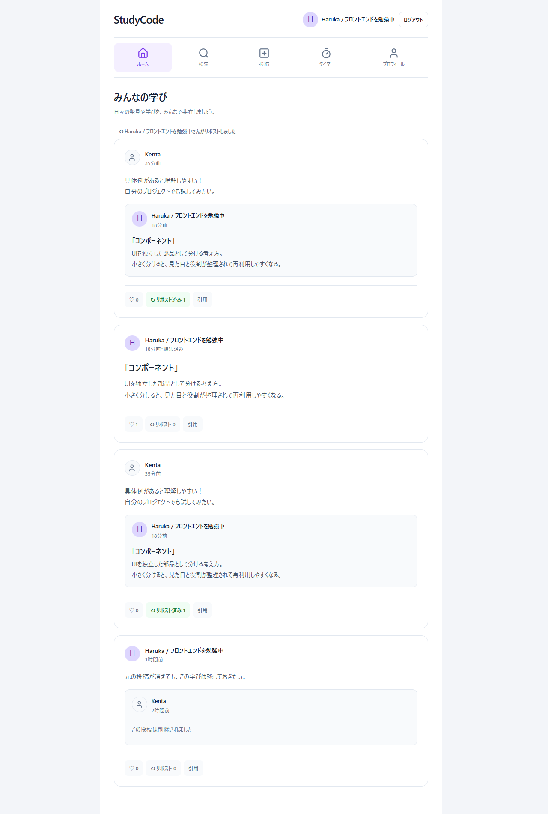
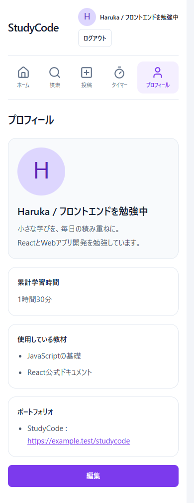
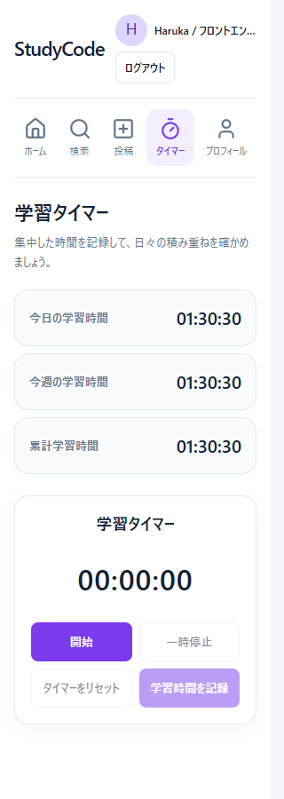

# StudyCode

プログラミング学習者向けのSNSです。学んだ用語や自分なりの理解を投稿し、他の学習者の説明や学習記録を見ながら、知識を深めることを目的に制作しています。

## アプリ概要

「学んだことを自分の言葉で説明する」ための投稿機能と、日々の積み重ねを確認する学習タイマーを備えています。投稿への返信や引用を通じて、他の学習者の考え方にも触れられます。

投稿の閲覧・検索はログインせずに利用できます。投稿やリアクション、プロフィール編集、学習時間の記録にはログインが必要です。

## 作成した背景

独学では、用語や概念について自分の理解が正しいか判断しにくいことがあります。同じ用語を他の学習者がどのように説明しているかを見られれば、自分に足りなかった視点に気づきやすいと考えました。

日々の学びを短い投稿としてアウトプットする習慣を作り、学習時間も可視化することで、継続を後押しするアプリを目指しています。

## 主な機能

| 分類 | 実装している機能 |
| --- | --- |
| 認証 | メールアドレス・パスワードによる新規登録、ログイン、ログアウト |
| プロフィール | ユーザー名・自己紹介の編集、プロフィール画像のアップロード・変更、他ユーザーのプロフィール表示 |
| 学習内容の投稿 | 用語と説明の投稿、自分の通常投稿の編集、「編集済み」表示、投稿削除 |
| 検索 | 全体・自分の投稿の検索、用語・説明・引用コメントの検索、新しい順・いいね順の並べ替え |
| 交流 | いいね・解除、リポスト・解除、コメントを添えた引用投稿 |
| タイムライン | 通常投稿とリポストを時刻順に表示（最新10件） |
| 投稿詳細・返信 | 投稿詳細の閲覧、リポスト、返信の投稿、自分の返信の削除 |
| 学習記録 | タイマーの開始・一時停止・リセット・記録、今日・今週・累計の学習時間表示 |
| 学習・制作情報 | 使用教材とポートフォリオURLの登録・削除、プロフィールでの表示 |
| 操作・表示 | スマートフォン対応、OS設定に応じたダークモード、Alt + ↑↓による入力欄移動、モーダルのTab・Escape操作 |

引用投稿は「コメント＋引用元」の形式です。引用元を削除しても引用した側のコメントは残り、引用元の本文の代わりに「この投稿は削除されました」と表示します。引用投稿自体の編集は現在対象外です。

## 使用技術

| 用途 | 技術 |
| --- | --- |
| フロントエンド | React 19、JavaScript、React Router 7、CSS、Lucide React |
| バックエンド / BaaS | Supabase（Authentication、PostgreSQL、Storage、Row Level Security） |
| ビルド・コード検査 | Vite 8、ESLint 10、npm |
| バージョン管理 | Git、GitHub |

## 技術的に工夫した点

### Supabaseのアクセス制御

Row Level Security（行単位のアクセス制御）で、投稿や返信などへの書き込みを本人に限定しています。プロフィール画像は公開用の`avatars`バケットに置き、アップロード・上書き・削除は自分のユーザーIDのフォルダだけに許可しています。画面上のボタン表示だけに頼らず、データ側でも制限しています。

### Reactのstateによる即時反映

いいねやリポストの成功時に、配列・オブジェクトを新しく作ってstateを更新します。プロフィール保存時には投稿者・引用元・リポストした人の情報も同期し、ユーザー名や画像をリロードなしで反映します。

### 通常投稿・引用・削除済み投稿の扱い

通常投稿は用語と説明、引用投稿はコメントと引用元IDを持ちます。引用元は別クエリでまとめて取得し、JavaScriptの`Map`で投稿に結合しています。削除は行を残して本文を消すソフトデリートとし、引用元の投稿者・投稿日時を保持します。

### 共通UIとキーボード操作

`Avatar`、`Post`、`QuotedPostCard`、ヘッダー、ナビゲーションなどを共通コンポーネントに分けています。フォームとボタンのCSSも共通化し、画面間の見た目と操作をそろえています。

## 画面

ローカル環境で撮影した実画面です。表示確認用のサンプルデータを使用しています。

### ホーム



### プロフィール・学習タイマー（スマートフォン幅）




## セットアップ方法

### 前提

- Node.js **24.x**、npm、Git
- アプリ用のテーブル・RLS・Storageを設定済みのSupabaseプロジェクト

このリポジトリにはDB作成用のマイグレーションは含まれていません。新しいSupabaseプロジェクトを作るだけでは動作しないため、[必要なテーブルと設定](docs/deployment.md#supabaseの前提)を確認してください。

### ローカル実行

```bash
git clone https://github.com/s23s232h-design/StudyCode.git
cd StudyCode
npm ci
```

`.env.example`を`.env.local`へコピーし、次の「環境変数」に従って値を設定します。

```bash
# macOS / Linux / Git Bash
cp .env.example .env.local
```

```powershell
# Windows PowerShell
Copy-Item .env.example .env.local
```

```bash
npm run dev
```

ターミナルに表示されるURL（通常は`http://localhost:5173`）で開きます。

### ビルド・検査

```bash
npm run check   # ESLintと本番ビルド
npm run preview # ビルド済みのdistをローカルで確認
```

個別には`npm run lint`、`npm run build`も利用できます。依存関係の監査は`npm audit --omit=dev`で実行できます。

## 環境変数

| 名前 | 設定する値 |
| --- | --- |
| `VITE_SUPABASE_URL` | SupabaseプロジェクトのURL |
| `VITE_SUPABASE_PUBLISHABLE_KEY` | ブラウザ向けのPublishable key |

`.env.example`の値は記入例です。Supabaseのプロジェクト設定から取得した値に置き換えてください。

`VITE_`で始まる環境変数はブラウザに配信されます。Secret keyや`service_role`キーは設定しないでください。公開キーでアクセスできる範囲はRLSで制限します。[Viteの環境変数の仕様](https://vite.dev/guide/env-and-mode)

環境ファイルはGit管理対象外です。環境変数が未設定の場合は開発サーバー・ビルドがエラーになります。変更後は開発サーバーの再起動、公開環境では再ビルド・再デプロイが必要です。

## デプロイ・公開前確認

Vercel向けの`vercel.json`を用意しています。`/posts/:postId`などを直接開いた場合もアプリに到達できるよう、SPA用のリライトを設定しています。

環境変数、Supabaseの認証URL、公開後の動作確認は[デプロイ手順・公開前チェック](docs/deployment.md)にまとめています。

## 今後追加したい機能

- 投稿のページネーションと、データ量が増えた場合の検索改善
- フォロー・通知・ブックマーク
- パスワード再設定
- 学習時間のグラフ表示と、タイマーの未記録時間のユーザー別管理
- DB構成のマイグレーション管理、主要操作の自動テスト拡充
